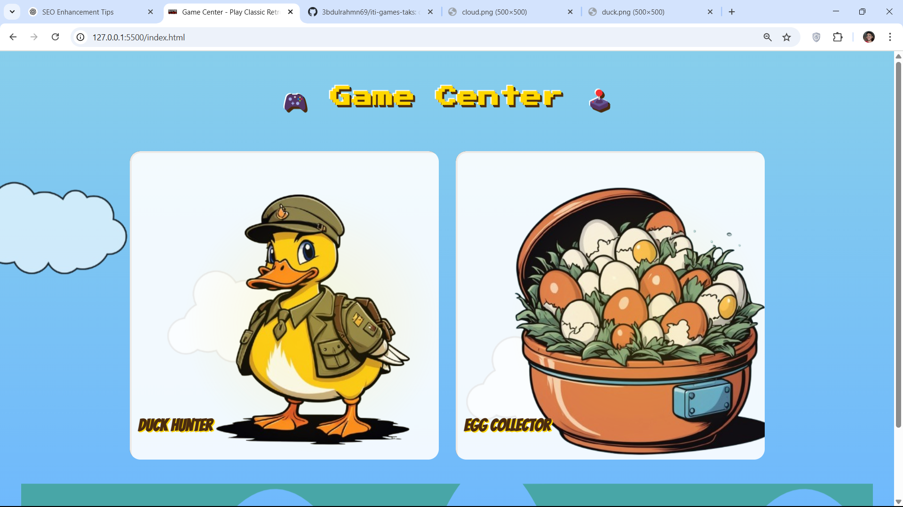
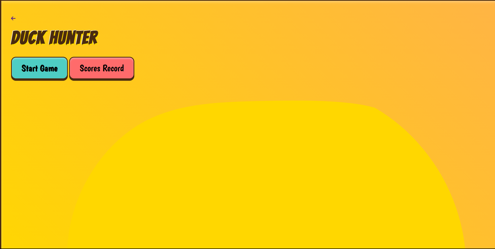
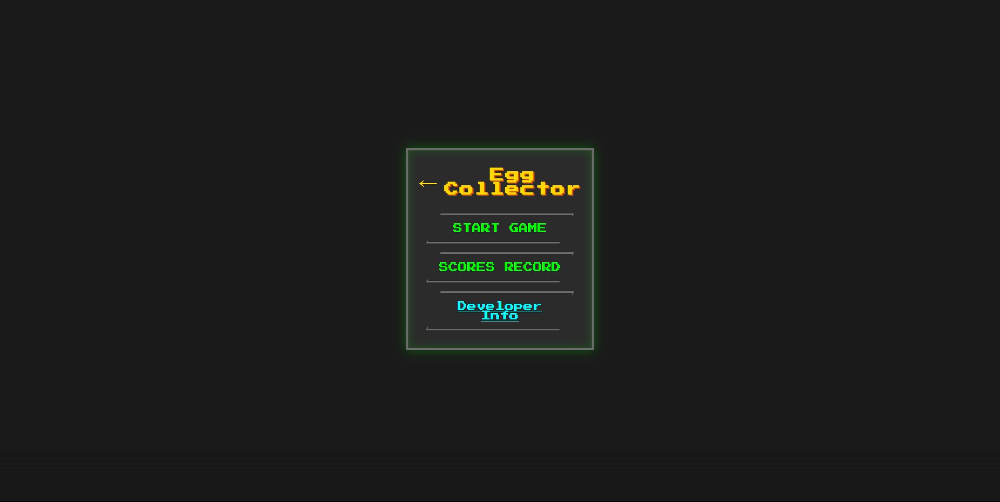

# 🎮 ITI Games Task

Welcome to **ITI Games Task**, a mini retro-themed game center built for the browser. This project includes two simple yet nostalgic games:


🎮 **[Demo](https://3bdulrahmn69.github.io/iti-games-taks/)**

## 🕹️ Included Games

1. **Duck Hunter**
   Aim, shoot, and test your reflexes in this classic-inspired duck shooting game.

   

   - **How to Play**: Use the mouse to aim and click to shoot. Hit as many ducks as you can before time runs out!

     🦆 **[Duck Game](https://3bdulrahmn69.github.io/iti-games-taks/games/duck.html)**

2. **Egg Collector**  
   Move fast and catch as many falling eggs as you can without letting them break!

   

   - **How to Play**: Use the arrow keys or mouse to move left and right. Catch the falling eggs in your basket, but avoid letting them hit the ground!

   🥚 **[Egg Collector Game](https://3bdulrahmn69.github.io/iti-games-taks/games/egg.html)**

## 🧑‍💻 Tech Stack

These games are created using:

- **HTML**
- **CSS**
- **JavaScript**

No frameworks, no libraries — just pure web fundamentals.

## 🎨 Theme

All games share a **retro gaming** aesthetic, paying homage to the classic 8-bit and arcade-style visuals.

## 🚀 Getting Started

To play the games:

1. Clone the repo

   ```bash
   git clone https://github.com/3bdulrahmn69/iti-games-taks.git
   ```

2. Open the `index.html` file in your web browser.

   ```bash
   open index.html
   ```

3. Enjoy the games!

## 📜 License

This project is licensed under the MIT License. Feel free to use, modify, and distribute it as you wish.

## 🤝 Contributing

Contributions are welcome! If you have suggestions for improvements or new features, please open an issue or submit a pull request.

## 📧 Contact

Created with 💻 by **Abdulrahman Moussa**

- GitHub: [@3bdulrahmn69](https://github.com/3bdulrahmn69)
- LinkedIn: [linkedin.com/in/3bdulrahmn69](https://linkedin.com/in/3bdulrahmn69)
- Email: abdelrahmanmoussa111@gmail.com
